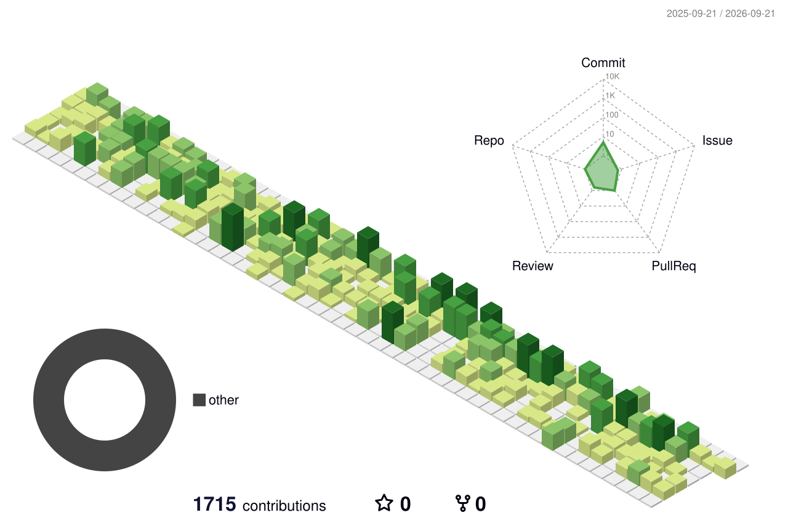

<h1 align="center">Hi, I'm Ivan 👋</h1>

Backend developer · Magento 2 / Adobe Commerce · PHP

  
  
  

---

### 🛒 What I do
- Build and maintain e-commerce stores on **Magento 2**
- Custom modules and third-party integrations (payments, SEO, catalog tooling)
- Security patching, upgrades and CI/CD deploys with **GitHub Actions**
- Local environments with **Docker / Warden**

### 🧰 Stack

  

### 📈 Activity

<picture>
  <source media="(prefers-color-scheme: dark)" srcset="./profile-3d-contrib/profile-night-rainbow.svg" />
  
</picture>

  

<picture>
  <source media="(prefers-color-scheme: dark)" srcset="https://raw.githubusercontent.com/BeggiNN/BeggiNN/output/snake-dark.svg" />
  
</picture>

### 📫 Contact
[LinkedIn](https://www.linkedin.com/in/ivan-petryshche-291875202/) · [Telegram](https://t.me/magentophp) · [vanyapetryshche@gmail.com](mailto:vanyapetryshche@gmail.com)
